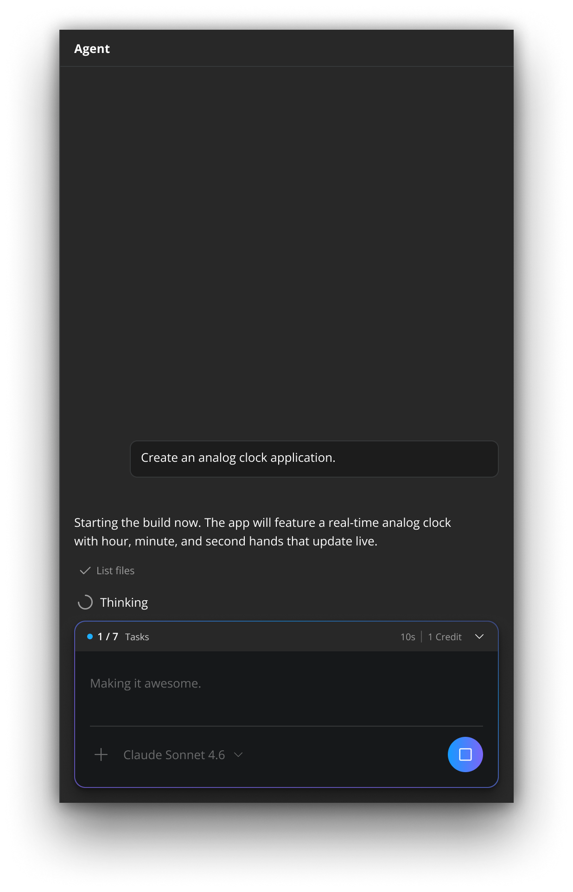

# Uno Platform Studio Agent

Uno Platform Studio Agent is the AI agent that powers app generation and editing in Uno Platform Studio App. It is the orchestration layer that connects AI models to the Uno Platform development workflow: it understands natural language, turns your intent into working code, and validates its own work against the running app before handing the result back to you.

You interact with the agent through the conversation panel. See [Conversation Panel & AI Agent](xref:Uno.PlatformStudio.GetStarted#conversation-panel--ai-agent) for the panel itself. This page explains what the agent does behind that panel, the context it works from, and how you stay in control.

## What Makes the Agent Uno-Aware

Generic AI coding tools can generate code quickly, but for real applications, generating code is not the same as building a working app. The Uno Platform Studio Agent is built specifically for cross-platform Uno Platform .NET apps so it can do what a generic agent cannot:

- **See the running app.** It can capture the live preview and read the runtime visual tree, so it reasons about how a change actually renders, not just how the source looks.
- **Know your design system.** It works within the theme, styles, and component library your project has standardized on, instead of producing generic markup.
- **Validate across targets.** Because Uno Platform apps run on web, desktop, mobile, and embedded from a single codebase, changes the agent makes are checked against a real build.
- **Ground answers in official docs.** It pulls context from version-correct Uno Platform documentation through the Uno docs MCP, rather than relying on memorized or outdated patterns. See the [Uno Platform MCPs](xref:Uno.Features.Uno.MCPs).
- **Stay inside a human-controlled loop.** The agent proposes and applies changes turn by turn, but you review every outcome and decide what to keep. See [Staying in Control](#staying-in-control).

## How a Turn Works

Each time you send a prompt, the agent runs a turn:

1. It reasons about your request and the current state of the project.
2. It uses tools to read the project, write or patch code, build, and inspect the running app.
3. It rebuilds the app so changes appear in the live preview through Hot Reload.
4. It ends the turn with an outcome card summarizing what happened.

While the turn is in progress, the conversation panel shows lightweight status indicators such as **Thinking…** or the name of the tool currently running. When the turn ends, you see an outcome card, for example **Application Ready** or **Awaiting your reply**. For the full list of statuses and outcomes, see [Common Messages and Errors](xref:Uno.PlatformStudio.Troubleshooting#generation-outcomes).

### Tools the Agent Uses

The agent completes work by invoking tools rather than only emitting text. The tools you will see it run include:

| Tool | What the agent uses it for |
| ---- | -------------------------- |
| **Read** / **List files** | Inspect the current project to understand existing code and structure before changing it. |
| **Write** / **Patch** | Create new files or apply targeted edits to existing XAML and C#. |
| **Build** | Compile the app and surface errors so the agent can correct them within the turn. |
| **Screenshot** | Capture the live preview to see how a change actually renders. |
| **Inspect visual tree** | Read the runtime visual tree of the running app to reason about layout and state. |
| **Click element** | Drive the running app to reach a specific screen or state before validating it. |
| **Generate API client** | Scaffold a typed client for a backend or API the app consumes. |

These tools are what let the agent verify its own work against the live app instead of guessing.

## Skills

The agent does not rely on general knowledge alone. It draws on a catalog of 70+ Uno Platform-specific skills (covering themes and Material Design, MVUX state management, navigation, toolkit controls, and UI test automation) and selects the relevant ones automatically as it works on your prompt. You do not invoke skills manually.

The same Uno Platform-specific skills are available to external agents (Claude Code, GitHub Copilot, and OpenAI Codex) through the `uno-platform-studio` plugin. See [Skills & Plugins](xref:Uno.PlatformStudio.Skills) for the full catalog and install steps.

## Staying in Control

The agent applies changes, but you remain the reviewer:

- **Review every turn.** Each turn ends with an outcome card so you can see what changed before continuing.
- **Stop and retry.** You can stop a turn while it is running and retry or refine your prompt. See [Generation stopped](xref:Uno.PlatformStudio.Troubleshooting#in-progress-status).
- **Add context.** You can attach PNG or JPEG images to a prompt to give the agent more to work with.
- **Keep your work.** Nothing leaves Uno Platform Studio App until you choose to **Export** the project to your IDE. See [Export and IDE Handoff](xref:Uno.PlatformStudio.GetStarted#export-and-ide-handoff).

> [!TIP]
> Prompt quality strongly affects result quality. For guidance on writing prompts that lead to better first results and fewer regeneration loops, see [Prompting Best Practices](xref:Uno.PlatformStudio.GetStarted#prompting-best-practices).

## Context and Conversation Limits

The agent works within a fixed context window. As a conversation grows, Uno Platform Studio App automatically compacts earlier messages before asking you to take action, so long sessions keep working. If a conversation can no longer be compacted, Uno Platform Studio App asks you to start a new one. Export the project first if you want to keep its current state. The exact messages you may see are listed under [Conversation Limits](xref:Uno.PlatformStudio.Troubleshooting#conversation-limits).

## Credits

Agent prompt-and-response cycles and the tool calls made during a turn consume credits, while Hot Design visual editing does not. For the full breakdown and how to top up, see [Credits & Usage](xref:Uno.PlatformStudio.GetStarted#credits--usage).
