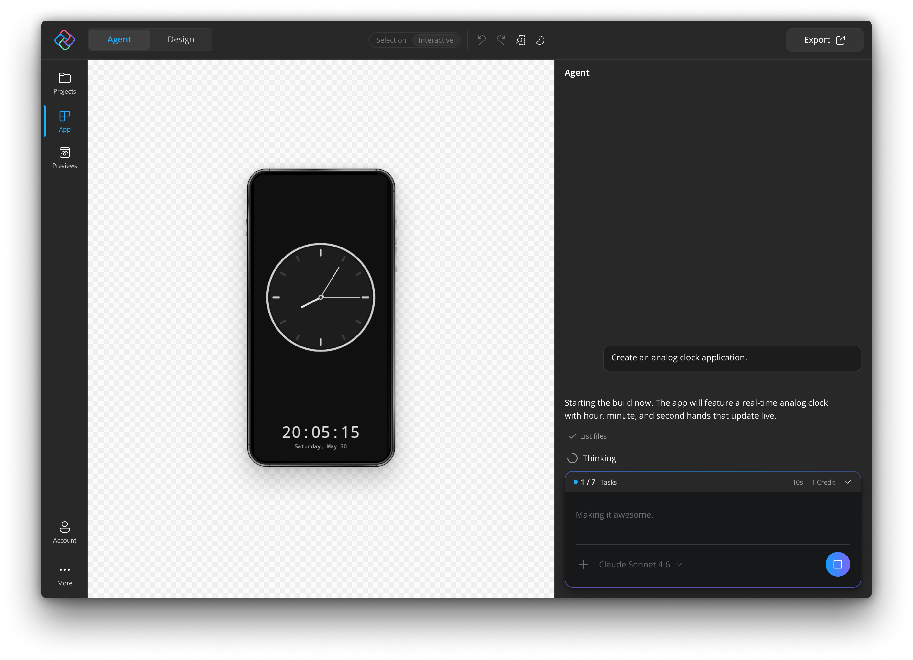
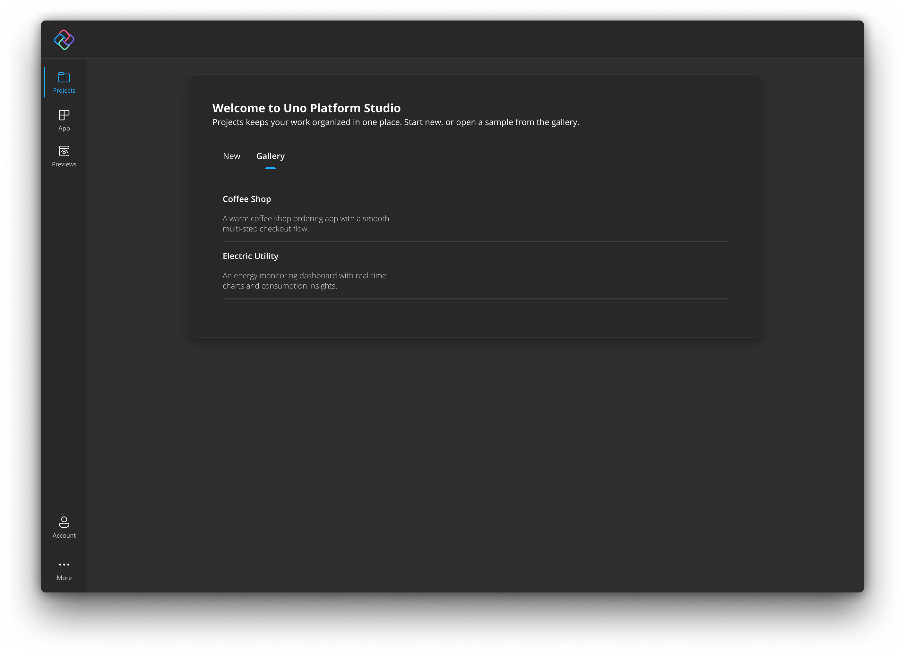

# Getting Started with Uno Platform Studio App

This guide walks you through creating your first app with Uno Platform Studio App. There is nothing to install upfront: [open it in your browser](https://studio.platform.uno/) and start from a prompt.

When you want to continue working locally, export your app and follow the [Uno Platform Get Started guide](xref:Uno.GetStarted) to set up Uno Platform in your IDE of choice.

## First Launch

The **Projects** page is the main entry point for starting work.

Use **New** to create a new app with a prompt.

- Enter a prompt describing the app you want to build, then submit the prompt.
- You can see the process as it happens in the Agent activity panel and view the app as it builds thanks to Hot Reload.
- When the app finishes building, you will see a recap summarizing what was generated.

### Gallery

Uno Platform Studio App also offers a curated set of samples of complete, working Uno Platform applications you can open, explore, and customize immediately.

When you open a sample, Uno Platform Studio App:

1. Clones the sample project into a fresh workspace.
2. Builds and starts the live preview.
3. Opens the conversation panel so you can immediately start customizing.

The sample is your own copy; any changes you make do not affect the original.

## The Uno Platform Studio App Interface

Uno Platform Studio App uses a shell around the app canvas to help you switch projects, open account details, export work, and reach support resources. This section covers the shell layout and the status colors you will see while working.

### Navigation Pane

The navigation pane is the main way to move between shell areas.

- From **Projects**, you can start a new project from a prompt or browse sample apps from the Gallery.
- From **App** you can access the main workspace. This is where you work with the app canvas and Hot Design.
- From **Previews** you can view generated pages. Previews only appear in the navigation bar once the agent starts generating pages.
- From **Account** you can review your subscription details and credit information.
- From **More** you can access quick links and support resources.

### Top Bar

When a project is loaded, the shell shows a top action bar inside the app area.

#### Export

Use **Export** to package the current project for use in a local IDE or source-control workflow. See [Export and IDE Handoff](#export-and-ide-handoff) for the full flow.

- The button is shown only when the workspace is active and the app content has loaded.
- While export is running, Uno Platform Studio App shows progress in place of the normal label.

### More Menu

Use **More** for quick links and support resources.

- **Documentation** opens the Uno Platform documentation in your browser.
- **Send feedback** starts the feedback export flow.
- **Community** opens a submenu of community links:
  - **Discord** opens the Uno Platform Discord community.
  - **YouTube** opens the Uno Platform YouTube channel.

### Status Indicators and Colors

Uno Platform Studio App uses color-coded status indicators to quickly communicate connection and runtime state.

| Color | Typical meaning | What to do |
| ----- | --------------- | ---------- |
| Green | Connected and healthy | Continue working normally |
| Yellow/Amber | Warning or degraded state | Review warnings and verify connectivity |
| Red | Error or disconnected state | Retry connection or restart the affected flow |
| Gray | Inactive, unknown, or not yet connected | Start session or trigger a connection check |

## Conversation Panel & AI Agent

The conversation panel is the primary way to interact with the AI agent in Uno Platform Studio App. The agent understands natural language and translates your intent into working code.

Enter your prompt in the text box at the bottom of the conversation panel and press **Enter** (or click the send button). The agent responds with an explanation of what it is doing and applies changes to your project.

You can also add image files (PNG or JPEG) into the prompt panel to give the agent additional context.

### Prompting Best Practices

Prompt quality strongly affects the app quality. Better prompts lead to better first results, fewer regeneration loops, and less cleanup after the app is created.

Good prompts:

- make the app goal explicit,
- describe the primary user,
- name the first few screens,
- define the key interactions, and
- constrain the visual direction enough to avoid generic output.

Strong prompts help the model make better decisions about navigation, data shape, layout hierarchy, and the amount of functionality to include in the first pass.

### Examples

#### Better starting prompt

"Create a project planning app for small teams. Include a dashboard, a project list, and a task detail page. The dashboard should show active projects, overdue tasks, and team progress. Use a clean enterprise layout with clear hierarchy and simple status badges."

#### Better refinement prompt

"Keep the same structure, but make the dashboard denser, add a left rail with Projects, Tasks, and Reports, and show task status with color-coded chips. Do not add new screens."

#### Better editing prompt

"On the task detail page, add editable priority, due date, and assignee fields. Keep the layout responsive and preserve the existing navigation structure."

These examples work because they tell the model what to preserve, what to change, and what to avoid.

## Export and IDE Handoff

[Export](#export) lets you move from Uno Platform Studio App to your day-to-day IDE workflow without losing project fidelity.

### Recommended Handoff Flow

1. Complete a scaffold or design iteration in Uno Platform Studio App.
2. Export the app from Uno Platform Studio App.
3. Open the exported project in your preferred IDE.
4. Restore dependencies and run a local build.
5. Commit or continue development in your normal source workflow.

New to Uno Platform? Follow the [Uno Platform Get Started guide](xref:Uno.GetStarted) to set up your Uno Platform environment and work in your IDE of choice.

## Credits & Usage

Uno Platform Studio uses a credit-based model for AI features such as app generation, agent interactions, and MCP tool calls.

| Activity | Uses credits |
| -------- | ------------ |
| Prompt-based app generation | Yes |
| Agent prompt and response cycles | Yes |
| Tool calls through AI workflows | Yes |
| Hot Design visual editing | No |

Actual credit usage can vary based on operation size, model usage, and response length.

### Purchasing Credits

Additional credits can be purchased from your [Uno Platform Studio account](https://aka.platform.uno/my-account).
