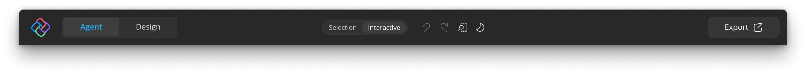

# The Uno Platform Studio Interface

Uno Platform Studio uses a shell around the app canvas to help you switch projects, open account details, export work, and reach support resources. This page covers the shell layout, the status colors you will see while working, and how credits are consumed.

## Navigation Pane

The navigation pane is the main way to move between shell areas.

- From **Projects**, you can start a new project from a prompt or browse sample apps from the Gallery.
- From **App** you can access the main workspace. This is where you work with the app canvas and Hot Design.
- From **Previews** you can view generated pages. Previews only appear in the navigation bar once the agent starts generating pages.
- From **Account** you can review your subscription details and credit information.
- From **More** you can access quick links and support resources.

## Top Bar

When a project is loaded, the shell shows a top action bar inside the app area.

### Export

Use **Export** to package the current project for use in a local IDE or source-control workflow. See [Export and IDE Handoff](xref:Uno.PlatformStudio.GetStarted#export-and-ide-handoff) for the full flow.

- The button is shown only when the workspace is active and the app content has loaded.
- While export is running, Uno Platform Studio shows progress in place of the normal label.

## More Menu

Use **More** for quick links and support resources.

- **Documentation** opens the Uno Platform documentation in your browser.
- **Send feedback** starts the feedback export flow.
- **Discord** opens the Uno Platform Discord community.
- **YouTube** opens the Uno Platform YouTube channel.

## Status Indicators and Colors

Uno Platform Studio uses color-coded status indicators to quickly communicate connection and runtime state.

| Color | Typical meaning | What to do |
| ----- | --------------- | ---------- |
| Green | Connected and healthy | Continue working normally |
| Yellow/Amber | Warning or degraded state | Review warnings and verify connectivity |
| Red | Error or disconnected state | Retry connection or restart the affected flow |
| Gray | Inactive, unknown, or not yet connected | Start session or trigger a connection check |

## Credits & Usage

Uno Platform Studio uses a credit-based model for AI features such as app generation, agent interactions, and MCP tool calls.

| Activity | Uses credits |
| -------- | ------------ |
| Prompt-based app generation | Yes |
| Agent prompt and response cycles | Yes |
| Tool calls through AI workflows | Yes |
| Hot Design visual editing | No |

Actual credit usage can vary based on operation size, model usage, and response length.

### Purchasing Credits

Additional credits can be purchased from your Uno Platform Studio account.
